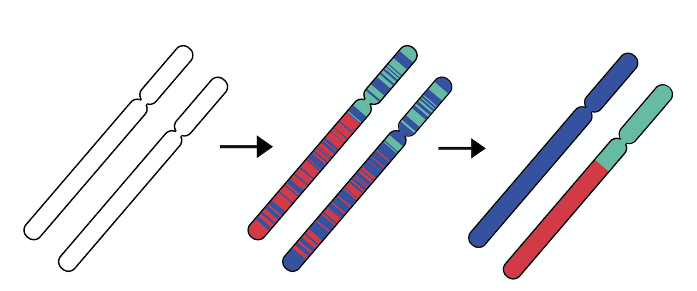

# XGFix 

Accurate phasing of genomic data is crucial for human demographic modeling and identity-by-descent analyses. It has been shown that leveraging information about an individual’s genomic ancestry improves performance of current phasing algorithms. XGFix is a method that uses local ancestry inference (LAI) to do exactly that.

(A) Sequenced haplotypes phased with a phasing software. (B) LAI used to label haplotypes with ancestry predictions and phasing errors become evident. (C) LAI-PEC  is applied to correct phasing errors.

XGFix uses a trained smoother from XGMix to estimate the probability of a given sequence being from the distribution of a human haplotype (correctly phased) and leverages those estimates to iteratively switch parts along the haplotypes to ultimately find the most probable one. 

- (a) Maternal and paternal haplotypes at a given iteration and a given step of XGFix. Dashed box marks the scope. 
- (b) Ancestry probabilities at windows in scope are extracted.
- (c) Windows in scope are permuted (to form possible fixes).
- (d)-(e) Permutations are passed through the smoother to obtain predictions and their confidence.
- (f) Permutation with highest confidence is chosen.
- (g) Windows in scope are returned to the haplotypes, preserving the scope’s right boundary (i.e. if rightmost window switched between haplotypes, entire 
right part switches too), before moving the scope one window  to the right for next step.

